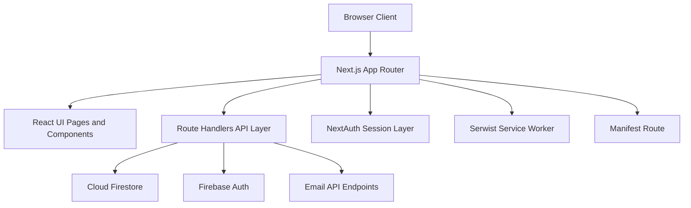

# CircleIn — Community Management Platform

## Overview
CircleIn is a full-stack community management platform for residential buildings, enabling residents to book amenities, raise maintenance requests, receive notifications, and connect with their community.

CircleIn uses a multi-tenant data model so each community operates with isolated settings, members, and operational workflows. The app is built on the Next.js App Router with a PWA layer powered by Serwist for installability and offline readiness. Residents get booking, profile, and notification flows while admins get operational controls for users, settings, analytics, onboarding, and maintenance. Real-time updates are backed by Firebase services, and the route-handler layer centralizes business logic for booking lifecycle, reminders, notifications, and account management.

## Key Features
### 🏠 Resident Features
- Amenity booking flows with create, confirm, cancel, recurring, reschedule, and waitlist promotion APIs.
- Offline booking queue with automatic sync when connection returns.
- Smart booking suggestions based on booking history patterns.
- Keyboard shortcuts for quick navigation: B (Bookings), D (Dashboard), S (Settings), and ? (Shortcuts help).
- Resident settings for profile, privacy, appearance, password updates, and account deletion request flow.
- Download My Data (GDPR) export as JSON from resident account flows.
- Community engagement features for announcements and polls.

### 🔧 Admin Features
- Admin dashboard modules for analytics, users, onboarding, waitlist management, maintenance, and settings.
- Amenity health score (0-100) with color-coded indicators.
- Weekly usage reports auto-generated and surfaced in analytics flows.
- Smart maintenance auto-routing with keyword-based category detection.
- Announcement pinning to keep critical updates at the top.
- Announcement file attachments (images/PDFs).
- Community polls with creation, voting, and expiry handling.
- Community-level settings sync for branding, booking rules, and operational preferences.
- Admin lifecycle routes for resident deletion and restoration operations.
- Admin utilities for amenity migration, reset, and onboarding setup.

### 📊 Analytics
- Amenity usage heatmap with a 7x24 occupancy view.
- Community dashboard widgets: weather, quick booking, pulse, and streak.

### 📱 PWA and Offline
- Web app manifest served by app/manifest.ts.
- Service worker source at app/sw.ts, built via @serwist/next into public/sw.js.
- Dedicated offline route and offline-capable static assets.

### 🔔 Notifications
- Booking reminder and digest cron endpoints.
- Push notification token registration endpoint.
- Email notification endpoints for operational and booking workflows.

### ⚙️ Automation (Cron)
- Auto-archival of old bookings to reduce active Firestore read load.
- Booking reminders with 24h, 1h, and 15min tiers plus .ics calendar attachments.
- Auto-conflict detection with next-available slot suggestions on clashes.

### 🔒 Security and Auth
- Session-based auth with NextAuth route handlers.
- Route protection and role checks in proxy.ts.
- Firestore-based serverless-safe rate limiting for sensitive API routes.
- Zod input validation on critical API routes.
- Content Security Policy and security headers configured in next.config.ts.
- API auth audit coverage: 84 API handlers reviewed; 2 intentionally public, 22 hardened with session auth, and 2 protected with CRON_SECRET.
- Firebase Auth integration for authentication and token-based verification.
- Firestore and Storage security rule files in repository root.

## Tech Stack


| Technology | Version | Purpose |
| --- | --- | --- |
| Next.js | 16.2.1 | Full-stack React framework with App Router and route handlers |
| React | ^19.2.0 | UI rendering and component model |
| TypeScript | ^5.9.3 | Static typing across app, API routes, and utilities |
| Tailwind CSS | ^3.4.17 | Utility-first styling system |
| Firebase / Firestore | ^12.5.0 | Auth, database, and client SDK integrations |
| next-auth | ^4.24.13 | Session and authentication flows |
| Framer Motion | ^12.38.0 | UI motion and transition effects |
| Zod | ^3.25.76 | Schema validation utilities |
| Serwist (@serwist/next + serwist) | latest / latest | PWA service worker build and runtime caching |
| Recharts | ^2.15.4 | Analytics and chart visualizations |

## Architecture Overview


## Getting Started
### Prerequisites
- Node.js >= 20.0.0 LTS
- npm >= 10.0.0
- A Firebase project with Firestore and Firebase Authentication enabled
- A Vercel account for deployment
- Git

### Environment Variables
The repository includes .env.example. Copy it to .env.local and fill in values for your project.

| Variable | Required | Description |
| --- | --- | --- |
| NEXT_PUBLIC_FIREBASE_API_KEY | Yes | Firebase web app API key used by the client SDK |
| NEXT_PUBLIC_FIREBASE_AUTH_DOMAIN | Yes | Firebase auth domain for client auth flows |
| NEXT_PUBLIC_FIREBASE_PROJECT_ID | Yes | Firebase project identifier used by client and server integrations |
| NEXT_PUBLIC_FIREBASE_STORAGE_BUCKET | Yes | Storage bucket used by Firebase storage integrations |
| NEXT_PUBLIC_FIREBASE_MESSAGING_SENDER_ID | Yes | Sender ID for Firebase messaging setup |
| NEXT_PUBLIC_FIREBASE_APP_ID | Yes | Firebase web app ID |
| NEXT_PUBLIC_FIREBASE_VAPID_KEY | Optional | Web push VAPID key for browser push notifications |
| NEXTAUTH_SECRET | Yes | NextAuth secret for session/token encryption |
| NEXTAUTH_URL | Yes | Base URL for auth callbacks and session handling |
| NEXTAUTH_DEBUG | Optional | Enables verbose NextAuth debug output |
| GOOGLE_CLIENT_ID | Yes | Google OAuth client ID for sign-in |
| GOOGLE_CLIENT_SECRET | Yes | Google OAuth client secret |
| FIREBASE_CLIENT_EMAIL | Optional | Service account client email for Firebase Admin SDK usage |
| FIREBASE_PRIVATE_KEY | Optional | Service account private key for Firebase Admin SDK usage |
| EMAIL_USER | Optional | SMTP/email provider username |
| EMAIL_PASSWORD | Optional | SMTP/email provider password |
| EMAIL_SENDER_NAME | Optional | Display name used for outgoing emails |
| CRON_SECRET | Optional | Secret token for protecting scheduled cron endpoints |
| GEMINI_API_KEY | Optional | API key for external AI integrations |
| ENABLE_EXTERNAL_AI | Optional | Feature flag for enabling external AI calls |
| NODE_ENV | Optional | Runtime environment mode; typically set by platform tooling |

### Installation
```bash
git clone https://github.com/saiabhinav001/circlein-app.git
cd circlein-app
npm install
cp .env.example .env.local
npm run dev
```

### Development
```bash
npm run dev      # Start development server (Turbopack)
npm run build    # Production build
npm run start    # Start production server
npm run lint     # Run ESLint
```

## Project Structure
```text
circlein-app/
├── app/
│   ├── (app)/                     # Authenticated app routes
│   ├── admin/                     # Admin-facing page routes
│   ├── api/                       # 84 API route handlers
│   │   ├── amenities/health-scores/
│   │   ├── amenities/[id]/heatmap/
│   │   ├── bookings/suggestions/
│   │   ├── cron/archive-bookings/
│   │   └── cron/weekly-report/
│   ├── auth/                      # Authentication pages
│   ├── auth-status/
│   ├── bookings/
│   ├── database-setup/
│   ├── offline/
│   ├── setup/
│   ├── manifest.ts                # PWA manifest route
│   └── sw.ts                      # Serwist service worker source
├── components/
│   ├── analytics/usage-heatmap.tsx
│   ├── amenity/
│   ├── auth/
│   ├── booking/
│   ├── calendar/
│   ├── chatbot/
│   ├── community/polls-widget.tsx
│   ├── dashboard/widgets/
│   ├── layout/
│   │   ├── keyboard-shortcuts-help.tsx
│   │   └── offline-indicator.tsx
│   ├── notifications/
│   ├── onboarding/
│   ├── providers/
│   ├── pwa/
│   ├── qr/
│   ├── settings/
│   └── ui/
├── hooks/                         # Custom React hooks (kebab-case filenames)
│   ├── use-advanced-bookings.ts
│   ├── use-booking-stats.ts
│   ├── use-community-notifications.ts
│   ├── use-firebase-auth.ts
│   ├── use-reminder-checker.ts
│   ├── use-sidebar-context.tsx
│   ├── use-simple-bookings.ts
│   ├── use-toast.ts
│   └── use-user-creation.ts
├── lib/                           # Shared utilities and services
│   ├── amenity-health-score.ts
│   ├── auth.ts
│   ├── booking-conflict-resolver.ts
│   ├── booking-pattern-analyzer.ts
│   ├── booking-service.ts
│   ├── firebase.ts
│   ├── ics-generator.ts
│   ├── maintenance-auto-router.ts
│   ├── offline-booking-queue.ts
│   ├── rate-limiter.ts
│   ├── report-generator.ts
│   ├── schemas.ts
│   ├── timezone.ts
│   ├── validation.ts              # Shared validation (Phase 3)
│   └── weather-service.ts
├── docs/                          # Project documentation hub (moved from root in cleanup phase)
├── public/                        # Static assets and generated service worker output
├── proxy.ts                       # Next.js 16 proxy layer for route protection
├── next.config.ts                 # Next.js configuration (TypeScript)
├── eslint.config.mjs              # ESLint 9 flat config
├── firestore.rules                # Firestore security rules
├── storage.rules                  # Firebase Storage security rules
└── package.json
```

## API Reference
CircleIn currently includes 84 API route handlers under app/api.

#### Access Codes (/api/access-codes/)
| Method | Path | Description |
| --- | --- | --- |
| POST | /api/access-codes/auto-replace | Rotates or replaces amenity access codes. |

#### Account (/api/account/)
| Method | Path | Description |
| --- | --- | --- |
| POST | /api/account/delete-request | Creates a resident account deletion request. |
| GET | /api/account/delete-request/admin | Lists deletion requests for admin review. |
| PATCH | /api/account/delete-request/admin/[id] | Updates status of a specific deletion request. |
| GET | /api/account/export | Exports account data for the current user. |

#### Admin (/api/admin/)
| Method | Path | Description |
| --- | --- | --- |
| GET, POST | /api/admin/clear-bookings | Reads and executes admin booking-clear operations. |
| GET, POST | /api/admin/delete-community | Reads and executes community deletion operations. |
| POST | /api/admin/delete-resident | Deletes a resident account and related records. |
| POST | /api/admin/onboarding/update-community | Persists admin onboarding community setup data. |
| DELETE | /api/admin/reset-amenities | Resets amenity records to a baseline state. |
| GET, POST | /api/admin/waitlist | Reads and processes waitlist management operations. |

#### Amenities (/api/amenities/)
| Method | Path | Description |
| --- | --- | --- |
| GET | /api/amenities/list | Returns amenity metadata and booking availability context. |
| POST | /api/amenities/update-time-slots | Updates amenity slot configuration. |

#### Assign Admin (/api/assign-admin)
| Method | Path | Description |
| --- | --- | --- |
| GET, POST | /api/assign-admin | Reads and applies admin assignment actions. |

#### Auth (/api/auth/)
| Method | Path | Description |
| --- | --- | --- |
| GET, POST | /api/auth/[...nextauth] | Handles NextAuth session and provider callbacks. |
| POST | /api/auth/firebase-token | Generates Firebase custom tokens for authenticated users. |
| GET | /api/auth/validate-user | Validates signed-in user status and access metadata. |

#### Auth Status (/api/auth-status)
| Method | Path | Description |
| --- | --- | --- |
| GET | /api/auth-status | Returns authentication status metadata for diagnostics. |

#### Bookings (/api/bookings/)
| Method | Path | Description |
| --- | --- | --- |
| POST | /api/bookings/create | Creates a new amenity booking. |
| POST | /api/bookings/cancel/[id] | Cancels a booking by booking ID. |
| GET, POST | /api/bookings/confirm/[id] | Reads and confirms bookings by ID. |
| POST | /api/bookings/recurring | Creates recurring booking instances. |
| POST | /api/bookings/reschedule/[id] | Reschedules an existing booking. |
| GET, POST | /api/bookings/promote-waitlist | Reads and executes waitlist promotion logic. |

#### Chatbot (/api/chatbot/)
| Method | Path | Description |
| --- | --- | --- |
| POST | /api/chatbot | Processes chatbot requests. |
| GET | /api/chatbot/status | Returns chatbot availability and health status. |

#### Check Reminders (/api/check-reminders)
| Method | Path | Description |
| --- | --- | --- |
| POST | /api/check-reminders | Triggers booking reminder checks. |

#### Check Token (/api/check-token)
| Method | Path | Description |
| --- | --- | --- |
| GET | /api/check-token | Verifies auth token state for troubleshooting. |

#### Cleanup Access Codes (/api/cleanup-access-codes)
| Method | Path | Description |
| --- | --- | --- |
| GET, POST | /api/cleanup-access-codes | Reads and runs access-code cleanup workflows. |

#### Community (/api/community/)
| Method | Path | Description |
| --- | --- | --- |
| POST | /api/community/announcements | Creates community announcements. |
| PATCH, DELETE | /api/community/announcements/[id] | Updates or deletes a specific announcement. |
| PATCH | /api/community/announcements/[id]/pin | Pins or unpins an announcement. |
| POST | /api/community/announcements/[id]/restore | Restores an archived announcement. |
| POST | /api/community/polls | Creates and votes on community polls. |
| POST | /api/community/polls/close-expired | Closes expired polls. |

#### Create Access Code (/api/create-access-code)
| Method | Path | Description |
| --- | --- | --- |
| POST | /api/create-access-code | Creates resident access codes. |

#### Create User (/api/create-user)
| Method | Path | Description |
| --- | --- | --- |
| POST | /api/create-user | Creates user records during onboarding/admin flows. |

#### Cron (/api/cron/)
| Method | Path | Description |
| --- | --- | --- |
| GET | /api/cron/auto-cancel | Executes auto-cancel checks for expired bookings. |
| GET | /api/cron/booking-reminders | Sends booking reminder notifications. |
| GET, POST | /api/cron/expire-waitlist | Expires stale waitlist entries. |
| GET, POST | /api/cron/send-reminders | Dispatches scheduled reminder jobs. |
| GET | /api/cron/test | Runs cron connectivity diagnostics. |
| GET, POST | /api/cron/weekly-digest | Generates and sends weekly digest content. |

#### Debug (/api/debug/)
| Method | Path | Description |
| --- | --- | --- |
| GET | /api/debug | Returns general API debug diagnostics. |
| GET | /api/debug/access-code | Returns access-code debug output. |
| GET | /api/debug/amenities | Returns amenity debug output. |
| GET | /api/debug/session | Returns session debug details. |

#### Debug Access Codes (/api/debug-access-codes)
| Method | Path | Description |
| --- | --- | --- |
| GET | /api/debug-access-codes | Returns access-code troubleshooting data. |

#### Debug User (/api/debug-user)
| Method | Path | Description |
| --- | --- | --- |
| GET | /api/debug-user | Returns user-level troubleshooting data. |

#### Delete User (/api/delete-user)
| Method | Path | Description |
| --- | --- | --- |
| GET, POST | /api/delete-user | Reads and executes user deletion workflows. |

#### Ensure Community (/api/ensure-community)
| Method | Path | Description |
| --- | --- | --- |
| GET | /api/ensure-community | Verifies or provisions community context for a user. |

#### Fix Amenity Names (/api/fix-amenity-names)
| Method | Path | Description |
| --- | --- | --- |
| POST | /api/fix-amenity-names | Runs amenity naming correction logic. |

#### Fix Released Codes (/api/fix-released-codes)
| Method | Path | Description |
| --- | --- | --- |
| GET, POST | /api/fix-released-codes | Reads and applies released-code fixes. |

#### Fix Users Access Codes (/api/fix-users-access-codes)
| Method | Path | Description |
| --- | --- | --- |
| GET, POST | /api/fix-users-access-codes | Reads and applies user access-code repairs. |

#### Init Database (/api/init-database)
| Method | Path | Description |
| --- | --- | --- |
| GET, POST | /api/init-database | Reads and runs database initialization flows. |

#### Maintenance (/api/maintenance/)
| Method | Path | Description |
| --- | --- | --- |
| GET, POST | /api/maintenance | Reads and creates maintenance requests. |
| PATCH | /api/maintenance/admin/[id]/status | Updates maintenance request status from admin flows. |

#### Manual Setup (/api/manual-setup)
| Method | Path | Description |
| --- | --- | --- |
| GET, POST | /api/manual-setup | Reads and executes manual setup actions. |

#### Migrate Amenity Names (/api/migrate-amenity-names)
| Method | Path | Description |
| --- | --- | --- |
| POST | /api/migrate-amenity-names | Migrates legacy amenity names to current format. |

#### Notifications (/api/notifications/)
| Method | Path | Description |
| --- | --- | --- |
| POST | /api/notifications/amenity-block | Sends amenity-block notifications. |
| POST | /api/notifications/amenity-unblock | Sends amenity-unblock notifications. |
| POST | /api/notifications/email | Sends email notification payloads. |
| POST | /api/notifications/push-token | Registers or updates push notification tokens. |

#### QR (/api/qr/)
| Method | Path | Description |
| --- | --- | --- |
| GET, POST | /api/qr/verify | Verifies QR payloads for access and booking actions. |

#### Recommendations (/api/recommendations/)
| Method | Path | Description |
| --- | --- | --- |
| GET | /api/recommendations/smart | Returns recommendation data for booking suggestions. |

#### Restore User (/api/restore-user)
| Method | Path | Description |
| --- | --- | --- |
| GET, POST | /api/restore-user | Reads and executes user restoration workflows. |

#### Send Email (/api/send-email)
| Method | Path | Description |
| --- | --- | --- |
| POST | /api/send-email | Sends transactional email messages. |

#### Set Admin Email (/api/set-admin-email)
| Method | Path | Description |
| --- | --- | --- |
| GET, POST | /api/set-admin-email | Reads and updates admin email assignment settings. |

#### Setup Database (/api/setup-database)
| Method | Path | Description |
| --- | --- | --- |
| GET, POST | /api/setup-database | Reads and runs database setup routines. |

#### Test (/api/test/)
| Method | Path | Description |
| --- | --- | --- |
| GET | /api/test/email | Returns test endpoint output for email routing checks. |

#### Test Access Code (/api/test-access-code)
| Method | Path | Description |
| --- | --- | --- |
| POST | /api/test-access-code | Validates access-code test payloads. |

#### Test Email (/api/test-email)
| Method | Path | Description |
| --- | --- | --- |
| GET | /api/test-email | Returns email test endpoint status. |

#### Update Flat Number (/api/update-flat-number)
| Method | Path | Description |
| --- | --- | --- |
| POST | /api/update-flat-number | Updates resident flat-number profile data. |

## Deployment
Recommended platform: Vercel with native Next.js support.

Set all required environment variables in the Vercel project dashboard before deploying.

Cron note: Vercel Hobby allows only one cron execution per day. The full cron automation set in this repo may require Vercel Pro for production cadence.

See [docs/deployment.md](docs/deployment.md) for the full deployment guide.

## Configuration
### Firebase Setup
Use [docs/firebase-setup.md](docs/firebase-setup.md) for project creation, authentication setup, and Firestore configuration.

### Email Setup
Use [docs/email-setup.md](docs/email-setup.md) for SMTP/provider settings and email workflow configuration.

### PWA Configuration
The app uses Serwist via @serwist/next for PWA support. The service worker source is app/sw.ts and is compiled to public/sw.js during build. The web app manifest is served by app/manifest.ts. No additional PWA setup is required for local development.

## Security
- Route protection is enforced in proxy.ts with role checks for admin routes and guarded access to authenticated sections.
- Session enforcement uses NextAuth callbacks and token-aware authorization logic.
- Firestore-based rate limiting is enabled for sensitive API flows.
- Zod validation guards critical API payloads.
- API auth audit coverage: 84 API handlers reviewed; 2 intentionally public, 22 hardened with session auth, and 2 protected with CRON_SECRET.
- Security headers are configured in next.config.ts, including CSP, HSTS, X-Content-Type-Options, X-Frame-Options, Referrer-Policy, and Permissions-Policy.
- Firebase Authentication is used for sign-in and token-based identity checks.
- Firestore access control is enforced by firestore.rules.
- Firebase Storage access control is enforced by storage.rules.

## Contributing
1. Fork the repository.
2. Create a feature branch: git checkout -b feat/your-feature
3. Make your changes following the kebab-case file naming convention.
4. Run the full verification suite:
   - npx tsc --noEmit
   - npm run build
   - npm run lint
5. Commit using Conventional Commits, for example feat:, fix:, refactor:, and docs:.
6. Open a Pull Request with a clear problem statement, scope, and validation notes.

All new files must use kebab-case naming. Component exports remain PascalCase (name only, not filename).

## Code of Conduct
- Be respectful and inclusive in all project discussions.
- Do not engage in harassment, discrimination, or personal attacks.
- Keep feedback technical, constructive, and actionable.
- Assume good intent and ask clarifying questions before escalating disagreements.
- Respect privacy and do not expose secrets, credentials, or personal data in issues or pull requests.
- Focus reviews on code quality, correctness, and maintainability.
- Report serious violations directly to the project maintainer.

## License
License not yet specified. Contact the project maintainer for usage terms.

## Acknowledgments
- Next.js provides the application framework and routing foundation.
- React provides the component model and rendering runtime.
- Firebase provides authentication, Firestore, and client SDK integrations.
- Tailwind CSS powers utility-first styling across the UI.
- shadcn/ui provides composable UI patterns used throughout the interface.
- Serwist powers service worker generation and runtime caching for PWA behavior.
- Framer Motion powers motion and transition interactions.
- Recharts powers analytics visualizations.
- Zod provides schema validation utilities.
- next-auth provides session and authentication orchestration.
