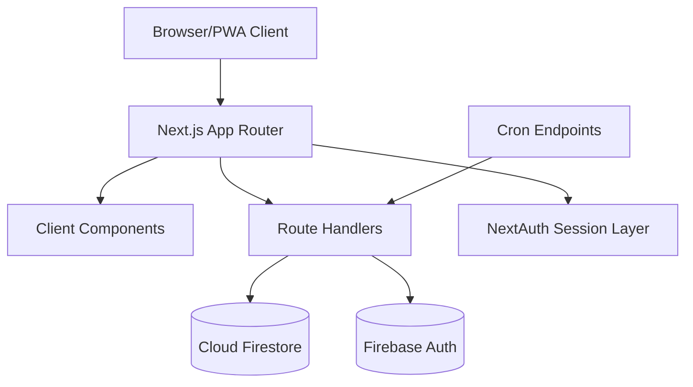

# CircleIn

CircleIn is a Next.js 16 community operations platform for residential buildings.
It combines amenity booking, notifications, maintenance tracking, and admin workflows in one multi-tenant app.

## What You Get

### Resident workflows
- Amenity browsing and booking with cancel, reschedule, recurring, and waitlist support.
- Dashboard widgets for weather, quick re-booking, community pulse, and booking streak.
- Smart booking suggestions based on recent patterns.
- Keyboard-driven command palette (Ctrl/Cmd + K, plus route shortcuts).
- PWA support with offline page and service worker integration.

### Admin workflows
- Admin dashboard for settings, waitlist, maintenance, and operations.
- Weekly report generation and analytics integrations.
- Automated booking archive flow to keep active collections lean.
- Maintenance categorization helpers and operations tooling.

### Platform capabilities
- App Router + Route Handlers architecture.
- NextAuth session auth with Firebase-backed data.
- Role-aware route protection via [proxy.ts](proxy.ts).
- Cron endpoints protected by shared secret checks.
- Type-safe UI and server code with TypeScript strict mode.

## Tech Stack

- Next.js 16.2.1 (App Router)
- React 19
- TypeScript 5
- Tailwind CSS + Radix UI primitives
- NextAuth (session auth)
- Firebase (Firestore + Auth + Admin SDK)
- Framer Motion
- Serwist (PWA service worker build/runtime)

## Quick Start

### 1) Prerequisites
- Node.js 20+
- npm 10+
- Firebase project with Firestore and Auth enabled
- Google OAuth client credentials

### 2) Install

```bash
git clone https://github.com/saiabhinav001/circlein-app.git
cd circlein-app
npm install
```

### 3) Configure environment

Copy [.env.example](.env.example) to `.env.local` and fill in values.

Required keys:
- `NEXT_PUBLIC_FIREBASE_API_KEY`
- `NEXT_PUBLIC_FIREBASE_AUTH_DOMAIN`
- `NEXT_PUBLIC_FIREBASE_PROJECT_ID`
- `NEXT_PUBLIC_FIREBASE_STORAGE_BUCKET`
- `NEXT_PUBLIC_FIREBASE_MESSAGING_SENDER_ID`
- `NEXT_PUBLIC_FIREBASE_APP_ID`
- `NEXTAUTH_SECRET`
- `NEXTAUTH_URL`
- `GOOGLE_CLIENT_ID`
- `GOOGLE_CLIENT_SECRET`

Optional but commonly used in production:
- `CRON_SECRET`
- `NEXT_PUBLIC_FIREBASE_VAPID_KEY`
- `FIREBASE_CLIENT_EMAIL`
- `FIREBASE_PRIVATE_KEY`
- `EMAIL_USER`
- `EMAIL_PASSWORD`

### 4) Run locally

```bash
npm run dev
```

Open http://localhost:3000.

## Useful Commands

```bash
npm run dev          # development server
npm run build        # production build
npm run start        # run production build
npm run lint         # eslint checks
npx tsc --noEmit     # typecheck
```

## Architecture Snapshot



## Automation and Cron

Configured in [vercel.json](vercel.json):

- `/api/cron/archive-bookings` -> `0 2 * * *`
- `/api/cron/weekly-report` -> `0 3 * * 1`

Operational note:
- Keep `CRON_SECRET` set in production.
- Unauthenticated direct hits to protected cron routes should return `401`.

## Security Model

- Session and role checks are enforced in route handlers and [proxy.ts](proxy.ts).
- Protected app routes redirect unauthenticated users to sign-in.
- Firestore and storage rules are versioned in [firestore.rules](firestore.rules) and [storage.rules](storage.rules).
- Security headers and build/runtime settings live in [next.config.ts](next.config.ts) and [vercel.json](vercel.json).

## Project Layout

```text
circlein-app/
|- app/                 # App Router routes and API handlers
|  |- (app)/            # authenticated app surfaces
|  |- (marketing)/      # marketing/legal routes
|  |- api/              # server route handlers
|  |- sw.ts             # service worker source (Serwist)
|- components/          # UI building blocks and feature components
|- hooks/               # custom React hooks
|- lib/                 # services, helpers, domain logic
|- docs/                # setup, deployment, architecture docs
|- public/              # static assets and generated SW output
|- proxy.ts             # route protection layer
|- vercel.json          # deployment and cron config
```

## Verification Checklist (Before Merge)

Run these commands and confirm clean output:

```bash
npm run lint
npx tsc --noEmit
npm run build
```

Also verify:
- Protected routes redirect when signed out.
- Command palette opens with Ctrl/Cmd + K.
- Cron endpoints are not publicly executable without secret.

## Documentation Map

Primary docs are in [docs](docs):

- [docs/start-here.md](docs/start-here.md)
- [docs/quick-reference.md](docs/quick-reference.md)
- [docs/technical-architecture.md](docs/technical-architecture.md)
- [docs/testing.md](docs/testing.md)
- [docs/deployment.md](docs/deployment.md)
- [docs/troubleshooting.md](docs/troubleshooting.md)

## License

This project is licensed under the MIT License. See [LICENSE](LICENSE).
